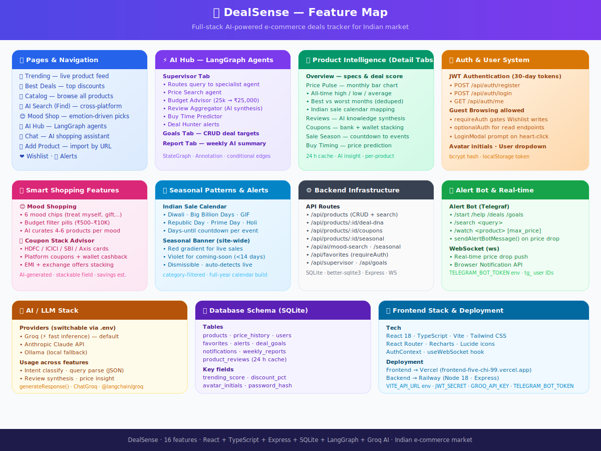
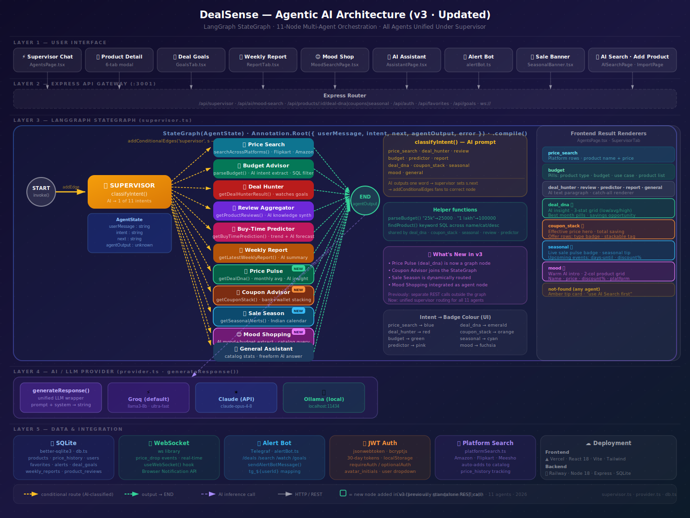

# DealSense — AI-Powered Indian E-Commerce Deals Tracker

> Full-stack agentic AI application that tracks deals, compares prices, predicts buy timing, and responds to your mood — all powered by a LangGraph multi-agent supervisor.

**Live Demo:** [https://frontend-five-chi-99.vercel.app](https://frontend-five-chi-99.vercel.app)  
**Backend API:** [https://deals-app-backend-production.up.railway.app](https://deals-app-backend-production.up.railway.app)

---

## Feature Map



---

## AI Agent Architecture



---

## Stack

| Layer | Technology |
|---|---|
| Frontend | React 18 + TypeScript + Vite + Tailwind CSS |
| Backend | Node.js 20 + Express + TypeScript |
| Database | SQLite (better-sqlite3) |
| AI Orchestration | LangGraph StateGraph (11-node supervisor) |
| LLM | Groq (llama-3.3-70b-versatile) / Claude / Ollama |
| Realtime | WebSocket (ws) |
| Alert Bot | Telegraf (Telegram) |
| Frontend Deploy | Vercel |
| Backend Deploy | Railway (Node 20, nixpacks) |

---

## AI Agent Graph

The LangGraph `StateGraph` routes every user message through an AI supervisor that classifies intent and dispatches to the right specialist agent:

```
START
  └─▶ supervisor (AI intent classifier)
        ├─▶ price_search   — cross-platform product search
        ├─▶ deal_hunter    — autonomous price-drop goal tracker
        ├─▶ review         — review aggregation + trust score
        ├─▶ budget         — best products within a budget
        ├─▶ predictor      — AI buy-time prediction
        ├─▶ report         — weekly deal intelligence report
        ├─▶ deal_dna       — price history & monthly trend analysis
        ├─▶ coupon_stack   — coupon + cashback + bank offer stacking
        ├─▶ seasonal       — upcoming sale events (Diwali, Big Billion Days)
        ├─▶ mood           — emotion-driven product suggestions
        └─▶ general        — general assistant fallback
              └─▶ END
```

---

## Features

### Trending & Deals
- **Trending Page** — top products ranked by trending score and discount
- **Best Deals** — highest discount products with countdown urgency
- **Catalog** — full product browser with category + price filters

### AI Search & Discovery
- **AI Search** — natural language search across Flipkart, Amazon India, Myntra, Nykaa, Meesho
- **Platform Search** — side-by-side price comparison across platforms
- **Mood Shop** — describe how you feel, get matched products ("I'm stressed", "treating myself", "gift for mom")

### Agentic AI Hub
- **LangGraph Supervisor** — 11 specialist agents orchestrated by AI intent routing
- **Price Predictor** — should you buy now or wait? ML-style trend analysis
- **Deal DNA** — price history DNA: cheapest month, average, trend direction
- **Coupon Stacker** — stack bank offers + coupons + cashback for maximum savings
- **Seasonal Alerts** — countdown to Diwali, Big Billion Days, End of Reason Sale
- **Deal Hunter** — set autonomous goals; agent monitors and alerts on price drop
- **Review Aggregator** — AI-synthesised review summary + trust score

### AI Assistant
- **Chat** — streaming multi-turn conversation with full catalog context

### Wishlist & Alerts
- **Wishlist** — save products with custom price-drop threshold
- **Alert Bot** — real-time Telegram notifications on price drops
- **Notifications** — in-app notification centre with unread count badge

### Import & Admin
- **Import by URL** — paste any Flipkart / Amazon product URL to import
- **Manual Import** — add products directly with custom fields
- **Bulk Import** — JSON array import for multiple products
- **Weekly Report** — AI-generated deal intelligence report with category insights

---

## Project Structure

```
deals-app/
├── frontend/                  # React + Vite SPA
│   └── src/
│       ├── pages/             # TrendingPage, AgentsPage, MoodSearchPage, …
│       ├── components/        # Navbar, ProductCard, LoginModal, …
│       ├── context/           # AuthContext
│       ├── api/               # client.ts — typed API wrapper
│       └── hooks/             # useWebSocket
│
├── backend/                   # Express + TypeScript API
│   └── src/
│       ├── routes/            # auth, products, agents, ai, favorites, …
│       ├── services/
│       │   ├── agents/        # supervisor (LangGraph), dealHunter, reviewAggregator, …
│       │   └── ai/            # provider, rag, platformSearch
│       ├── database/          # SQLite init + schema
│       ├── middleware/        # JWT auth guard
│       └── models/            # TypeScript types
│
└── docs/
    ├── features.svg           # Feature map
    └── ai-architecture.svg    # Agent architecture diagram
```

---

## Local Development

### Prerequisites
- Node.js ≥ 20
- A free [Groq API key](https://console.groq.com) (or Ollama for local LLM)

### 1. Clone & install

```bash
git clone https://github.com/prasadvedula/deals-app.git
cd deals-app
```

### 2. Backend

```bash
cd backend
cp .env.example .env          # add GROQ_API_KEY and JWT_SECRET
npm install
npm run dev                    # http://localhost:3001
```

### 3. Frontend

```bash
cd frontend
cp .env.example .env          # set VITE_API_URL=http://localhost:3001
npm install
npm run dev                    # http://localhost:5173
```

---

## Environment Variables

### Backend (`.env`)

| Variable | Description | Required |
|---|---|---|
| `GROQ_API_KEY` | Groq LLM API key ([get one free](https://console.groq.com)) | Yes |
| `JWT_SECRET` | Secret for signing auth tokens | Yes |
| `ANTHROPIC_API_KEY` | Claude API key (optional, fallback LLM) | No |
| `TELEGRAM_BOT_TOKEN` | Telegram bot token for price alerts | No |
| `PORT` | Server port (default 3001) | No |

### Frontend (`.env`)

| Variable | Description |
|---|---|
| `VITE_API_URL` | Backend base URL (e.g. `http://localhost:3001`) |

---

## Deployment

### Backend → Railway

```bash
cd backend
railway login
railway link
railway up
```

Railway auto-builds with `nixpacks` (Node 20 pinned via `nixpacks.toml`).

### Frontend → Vercel

```bash
cd frontend
vercel --prod
```

Set `VITE_API_URL` to your Railway backend URL in Vercel project settings.

---

## API Endpoints

| Method | Path | Description |
|---|---|---|
| `POST` | `/api/auth/register` | Create account |
| `POST` | `/api/auth/login` | Login, returns JWT |
| `GET` | `/api/products` | List products (filters: category, platform, search, sort) |
| `GET` | `/api/products/trending` | Top trending products |
| `GET` | `/api/products/best-deals` | Highest discount products |
| `POST` | `/api/ai/search` | Natural language AI search |
| `POST` | `/api/ai/platform-search` | Cross-platform price comparison |
| `POST` | `/api/ai/chat` | Streaming assistant chat |
| `POST` | `/api/agents/chat` | LangGraph supervisor (11 agents) |
| `GET` | `/api/agents/goals` | Autonomous deal goals |
| `POST` | `/api/agents/goals` | Create a deal goal |
| `GET` | `/api/favorites` | User wishlist |
| `POST` | `/api/favorites` | Add to wishlist |
| `GET` | `/api/notifications` | Price drop notifications |
| `POST` | `/api/import/url` | Import product from URL |
| `GET` | `/api/health` | Health check |

---

## How Agentic AI Works

1. **User sends a message** to `/api/agents/chat`
2. **LangGraph StateGraph** initialises with the message as state
3. **Supervisor node** calls the LLM to classify intent into one of 11 categories
4. **Conditional edges** route state to the matching specialist agent node
5. **Specialist agent** queries the DB, calls AI services, writes result to state
6. **Graph terminates** at `END` and the result is returned to the frontend
7. **Frontend renders** intent-specific UI: budget grids, mood cards, coupon stacks, seasonal countdowns, etc.

The supervisor uses a single AI classification prompt — no hardcoded keyword matching — making it robust to phrasing variations ("cheapest phone", "best mobile under 25k", "smartphone budget ₹20000" all route to `budget`).

---

## License

MIT
